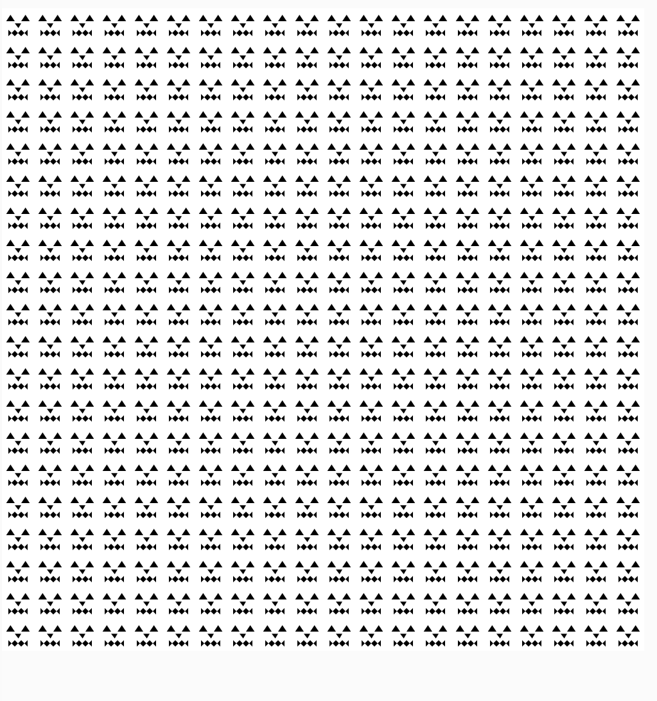

# Midterm 
#### by Mila Fossey

### Phase 1

I started by designing what my drawing would be in class. I started with a crown, 3 triangles with 3 squares underneath each, but I decided to do some kind of carved pumpkin face instead. This pumpkin face is structured by 2 triangles as the eyes, one triangle as the nose, and 8 triangles on the mouth where they kep progressively inverted, and 4 out of them get inverted in order to create two diamonds. I was already bracing myself for the monstrosity of the drawing that I had created.

### Phase 2

To start the drawing of my pumpkin face into P5js, I followed the code along from class, and created 8 different triangles with each their own coordinates. It took me a while to be able to place everything correctly. I actually started by creating a pumpkin face that looked nothing like the one I had drawn. All the triangles were the same size, and the mouth did not have any inverted triangles. I started again, really pinpointing where each coordinate was, because I would get lost a lot. I had trouble figuring out which point was x1, y1, x2, y2, x3, y3. I think getting the drawing right might have been what took me the longest out of the entire midterm. I kept testing things out to see what would work, and try and re-try. I wanted to make different sections for each part of the face, but just ended up listing each triangle one after the other. I ended up with this code:
function setup() {
  createCanvas(150, 150); 
  noStroke(); 
}

function draw() {
  fill(0); 
  triangle(20, 60, 40, 30, 60, 60); 
  triangle(90, 60, 110, 30, 130, 60);
  triangle(60, 70, 90, 70, 77, 92);
  triangle(30, 130, 30, 100, 45, 115);
  triangle(60, 130, 60, 100, 45, 115);
  triangle(60, 130, 60, 100, 75, 115);
  triangle(75, 115, 90, 100, 90, 130);
  triangle(90, 130, 90, 100, 105, 115);
  triangle(105, 115, 120, 100, 120, 130);  
}
The construction of this code was simple, but super tedious for my drawing - lots of trial and error, but once I got the hang of it, I knew what I was doing.

### Phase 3

For Phase 3, I based it on the same code made for Phase 2, as well as the code along from class for Phase 3. I started by trying to figure the whole thing out myself and not looking at the code from class, leading one of my drawings to be much bigger than the other one, and put in a diagonal position, which was not the requirement. I looked at the code along from class, and used it as a template. I added in 
function drawObject(x, y, s) {
  push();
  translate(x, y);
  scale(s);
  as well as pop(); at the end of the drawing, as was written in the code along, and that worked perfectly. I also changed values, and took away different statements to see what the error would show up as in P5js. I also researched the fucntions I didn't recognize in P5js.
  
### Phase 4

This Phase was super challenging for me. I approached it as if I was creating a table - which it technically is. So I built this grid for my drawing to display in a 20x20 grid. I could've written let for a lot of the statements, but I strongly prefer writing const. If the code itself isn't going to change, it feels more visually and logically pleasing to me to write const.
I based this code off of Phase 3, so I started with that code:
function setup() {
  createCanvas(500, 500); // I made the canvas 500, 500.
  noStroke(); 
}
function drawObject(x, y, s) {
  push();
  translate(x, y);
  scale(s);
  fill(0); 
  triangle(20, 60, 40, 30, 60, 60); 
  triangle(90, 60, 110, 30, 130, 60);
  triangle(60, 70, 90, 70, 77, 92);
  triangle(30, 130, 30, 100, 45, 115);
  triangle(60, 130, 60, 100, 45, 115);
  triangle(60, 130, 60, 100, 75, 115);
  triangle(75, 115, 90, 100, 90, 130);
  triangle(90, 130, 90, 100, 105, 115);
  triangle(105, 115, 120, 100, 120, 130);  
  pop();
}

After this, I started with another 
function draw() { -- I didn't put this in at first, because I don't why, but I forgot you had to ask to draw a table in, and that that function is seperate from the other drawings previosuly made.
  background(400); // making it a write background
    I then divided the table into a 20x20 grid :  const columns = 20, rows = 20;
  I struggled starting with this because I wasn't sure what the structure should be with everything. I wanted to put parenthesis around everything, and nothing worked, so I got pretty stressed. I realized that when writing const or let you do not have to put brackets. I also re-googled a lot of symbols I would find in the code alongs to make sure they would work.
   const cubeWidth = width / columns, cubeHeight = height / rows; // this was written to calculate the dimensions of each singular grid, which for some reason I thought was the area of each grid, but IT WAS NOT. I definitely needed a little refesher!
  
 const scaleDrawing = max(cubeWidth, cubeHeight) / 150; - was put in to make sure the unit size is 150x150 - the original drawing size - so they each fit into one cube accordingly, and don't overlap or 'get lost', and using max instead of min just ensures everything will show in each singular drawinng cube. I did try to plug min in to see what would happen, and that's what happened.
  I then started a loop from 0-19 which I created referencing the code along for fizzbuzz in github - where I wrote :  for (let row = 0; row < rows; row++) {
 for (let column = 0; column < columns; column++), through both the rows and columns.
I then made a statement to drawObject at the right position on the grid -- which was :  drawObject(column * cubeWidth, row * cubeHeight, scaleDrawing); - It took me a while to get accustomed to scale. I wasn't too sure what it did, but after research, removing and reincorporating.
My final statement was drawObject(column * cubeWidth, row * cubeHeight, scaleDrawing); which was used to actually draw the whole grid and create what we wanted where all the previous equations work hand in hand. It basically works as a resume of every other statement I wrote in this section to print the grid, from my understanding. The column section of this statement gives the X position and the row position gives the Y position, and scaleDrawing prevents it from overlapping.I equally based a lot of this code off of the nested for loop tutorial for in P5js. This helped me a lot gain clarity on the structure the loop should take. This Phase had a lot more math involved, which definitely hit me hard at first, but I came around to it and realized it wasn't as crazy as the image I was painting of it in my head.

##### Resources
I also watched a few youtube videos to get a better understanding of what I was tackling. I watched one video to have a different explanation just on how the drawings work in P5js with javascript, and how canvas, background, drawObject, and so on work. That youtube video was: https://youtu.be/c3TeLi6Ns1E?si=NTgFOdtM3HftgYus.

I referenced a P5js tutorial of nested for loops which I used for Phase 4, to figure out how to place and lay down my grid, in terms of structure, and mathematical structure: https://editor.p5js.org/marynotari/sketches/ryAqIX43b. This person showed how to do a grid layout with column and rows calculations.

I also looked at https://youtu.be/Wg7SdUpaWy4?si=rpIIUD9Fo4LxjZCA at 9:29 to get another idea of how someone would code their grid layout differently. It was hard for me to decipher at first, but little by little I was understanding the code, and it gave me another perspective on grid layout.

The last youtube video I looked at to get another idea at making a grid of a drawing using nested loops was: https://www.youtube.com/watch?v=Bpi_O-VhuCw. This gave me the simplest and quickest, in my opinion, was to create a grid. I kind of used all of these as templates and went from there. 

I also learned a lot of other random things through this midterm. I changed a lot fo things to figure out how stuff worked. I managed to change the background to bright pink somehow. I think the code for that was background(250, 0, 250);, so that was a fun surprise.

I had many many many syntax errors all throughout this, mainly because I would create my own functions, and forgot I would name something a certain way, and just call it something completely different later on.